# Курсова робота: Веб-додаток CourseworkMP

## Опис проєкту
Цей проєкт є веб-додатком на Flask, розробленим у рамках курсової роботи. Додаток реалізує REST API для управління товарами, інтеграцію з API НБУ для отримання курсів валют, систему автентифікації Basic Auth та використовує базу даних SQLite.

Проєкт повністю контейнеризовано (Docker) та налаштовано CI/CD пайплайн (GitHub Actions), який автоматично запускає тести та публікує образ у Docker Hub.

---

## Демонстрація роботи системи

### 1. Головна сторінка та API Валют
Додаток має привітальну сторінку та окремий модуль для відображення поточних курсів валют, отриманих із зовнішнього API.

  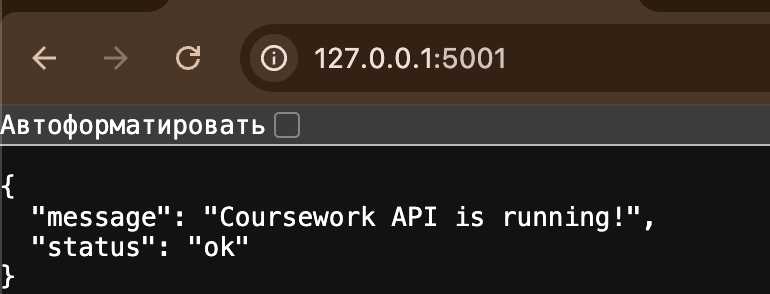

<b>Рисунок 1 - Головна сторінка сервера</b>

  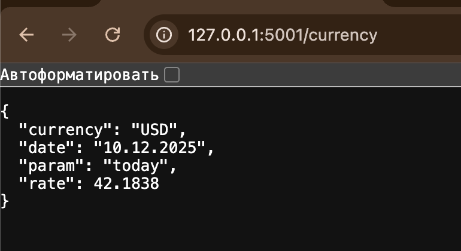

<b>Рисунок 2 - Інтеграція з API НБУ</b>

### 2. Робота зі списком товарів (CRUD)
Реалізовано повний цикл управління товарами. Інтерфейс коректно обробляє порожню базу даних.

  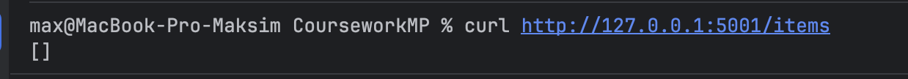

<b>Рисунок 3 - Відображення порожнього списку</b>

Форма створення товару дозволяє додавати нові записи до бази даних.

  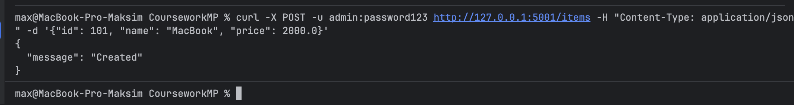

<b>Рисунок 4 - Форма створення товару</b>

Після додавання товари відображаються у загальному списку з можливістю управління.

  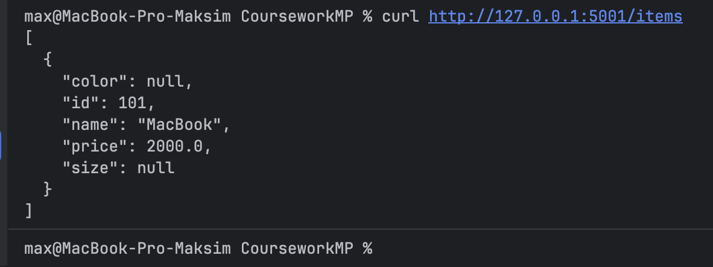

<b>Рисунок 5 - Список товарів</b>

### 3. Редагування та видалення
Кожен запис можна змінити або видалити.

  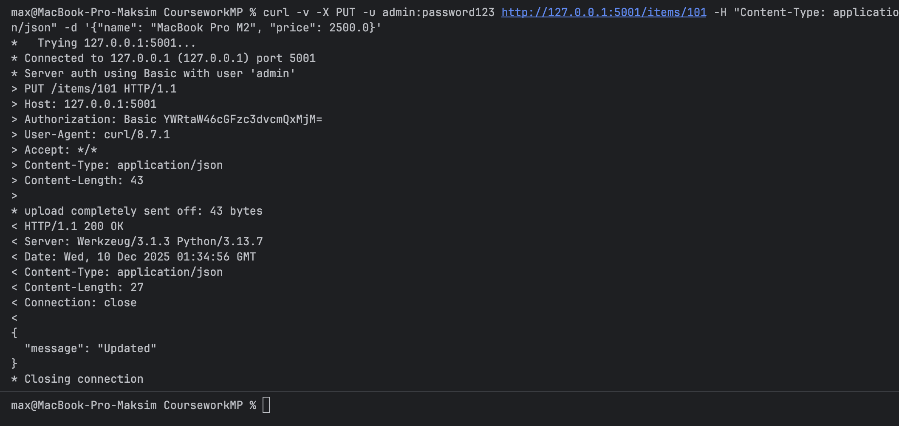

<b>Рисунок 6 - Редагування товару</b>

  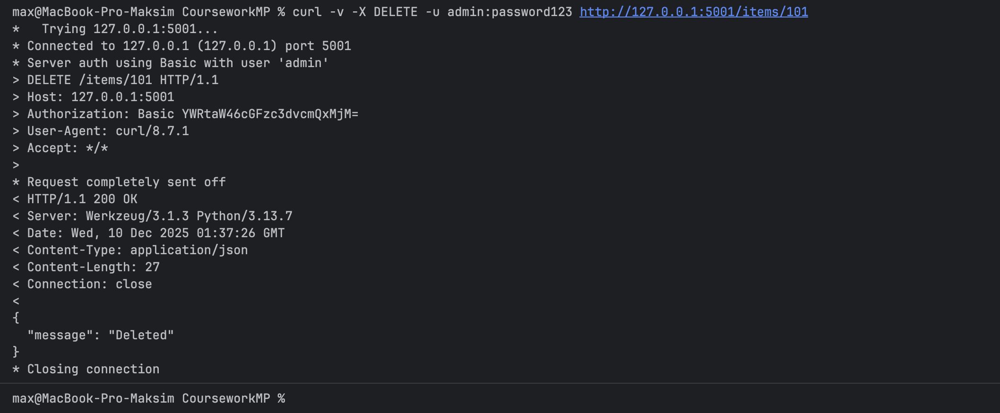

<b>Рисунок 7 - Видалення товару</b>

### 4. Безпека (Basic Auth)
Методи зміни даних захищені. При спробі доступу без пароля повертається помилка 401.

  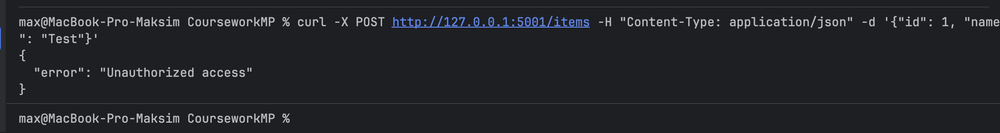

<b>Рисунок 8 - Перевірка Basic Auth (помилка)</b>

### 5. База даних
Дані зберігаються у реляційну базу даних SQLite.

  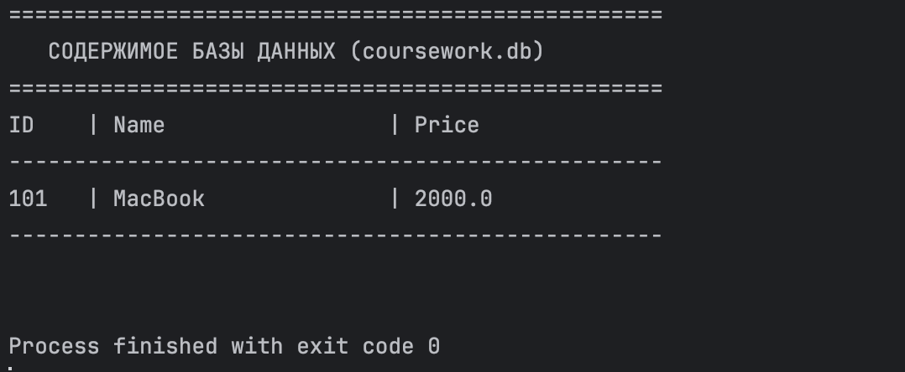

<b>Рисунок 9 - Структура БД SQLite</b>

---

## Тестування та CI/CD

### Unit-тести
Для перевірки надійності коду написані тести на `pytest`.

  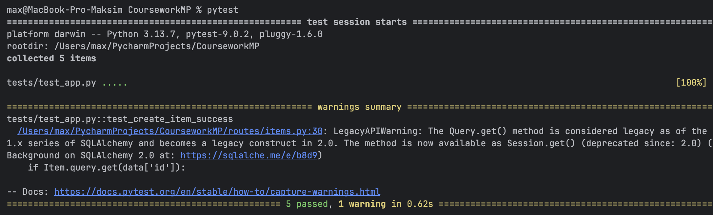

<b>Рисунок 10 - Успішне проходження тестів</b>

### Docker Hub та GitHub Actions
Налаштовано автоматичний деплой образу до реєстру контейнерів.

  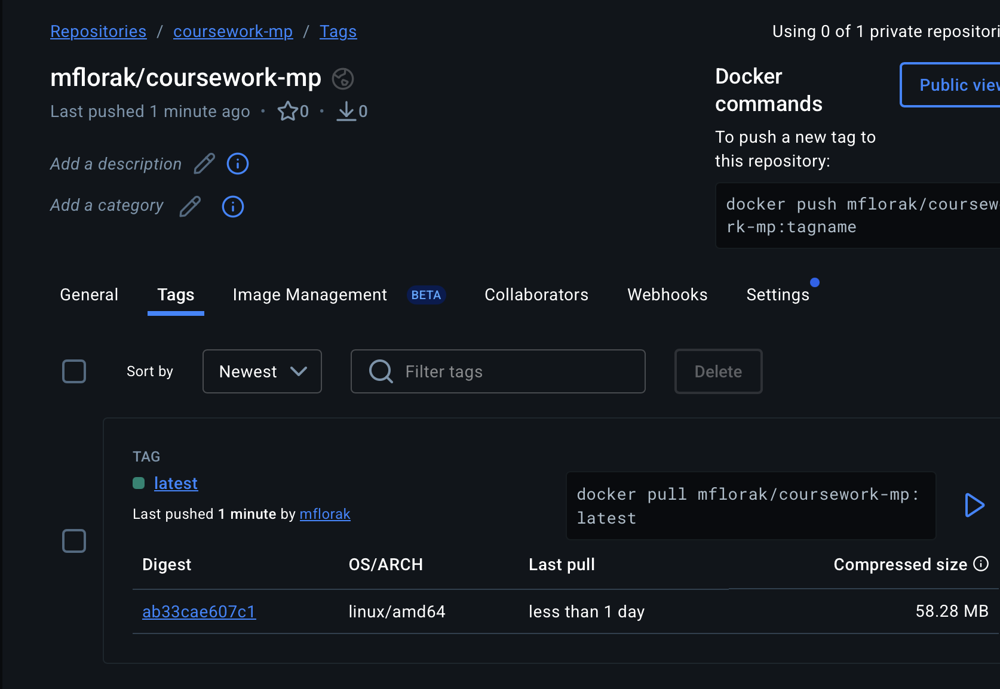

<b>Рисунок 11 - Результат CI/CD у Docker Hub</b>

---

## Висновки

У ході виконання курсової роботи було успішно спроектовано та реалізовано інтегрований веб-додаток на базі фреймворку Flask. Проєкт демонструє повний цикл розробки, починаючи від реалізації REST API для керування даними товарів та їхнього збереження у реляційній базі даних SQLite, закінчуючи інтеграцією із зовнішніми сервісами, зокрема API Національного Банку України для отримання курсів валют. Окрему увагу було приділено безпеці, що виразилося у впровадженні механізму аутентифікації Basic Auth для захисту критичних маршрутів.

Крім основного функціоналу, у проєкті реалізовано важливі DevOps-практики. Це включає покриття коду unit-тестами за допомогою фреймворку pytest для забезпечення його надійності. Додаток було успішно контейнеризовано в Docker, що гарантує його портативність та легкість розгортання в будь-якому середовищі. Фінальним етапом стало налаштування автоматичного пайплайну CI/CD через GitHub Actions, який автоматизує тестування, збірку образу та його публікацію у Docker Hub, демонструючи повну автоматизацію процесу доставки коду.
